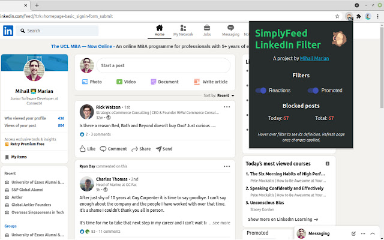
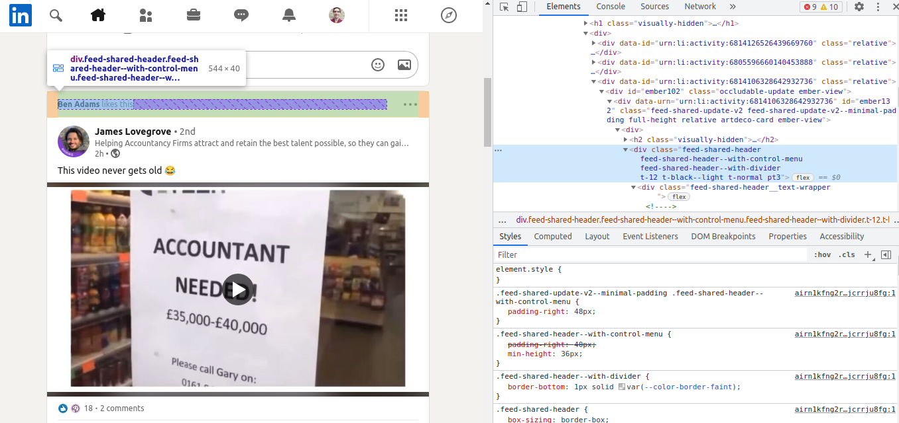
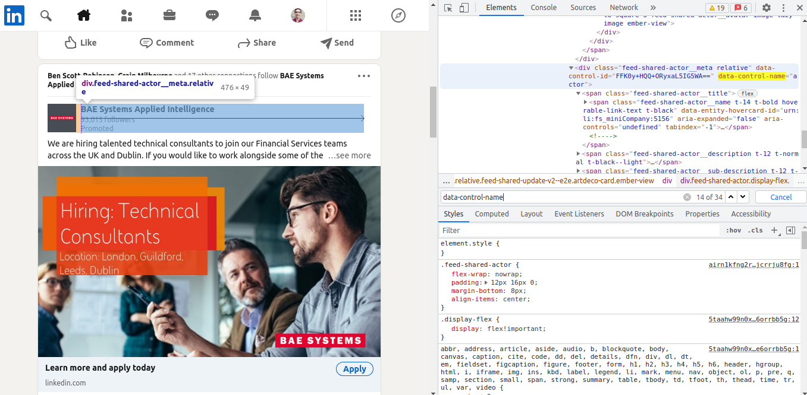
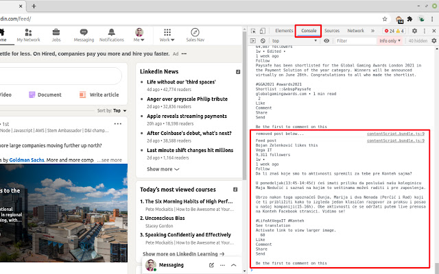
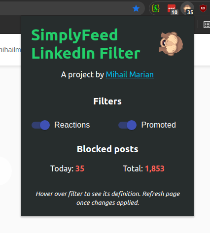
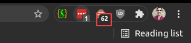
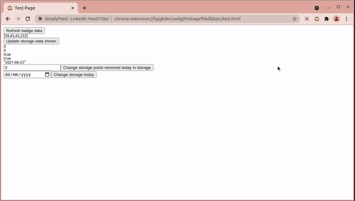
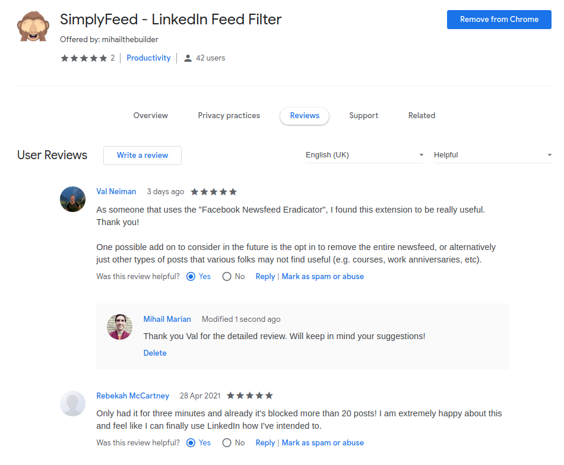
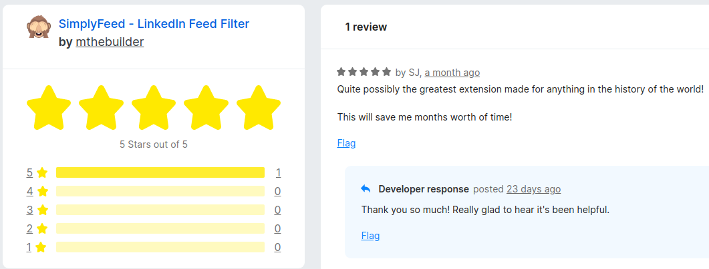

# SimplyFeed

Browser extension that filters liked and promoted posts in your LinkedIn feed. Available for download from the [Chrome Web Store](https://chrome.google.com/webstore/detail/simplyfeed-linkedin-feed/hpjgkdecioodgjhhdoagefbbdlljkpic) and [Firefox Browser Add-Ons](https://addons.mozilla.org/en-GB/firefox/addon/simplyfeed-linkedin-filter/).



# Table of contents

- [SimplyFeed](#simplyfeed)
- [Table of contents](#table-of-contents)
- [Architecture](#architecture)
- [Features](#features)
  - [Activation triggers](#activation-triggers)
  - [Filters](#filters)
    - [Reaction posts](#reaction-posts)
    - [Promoted posts](#promoted-posts)
  - [Console logging](#console-logging)
  - [Pop-up](#pop-up)
  - [Empty feed fallback](#empty-feed-fallback)
  - [Badge](#badge)
  - [Uninstall redirect](#uninstall-redirect)
  - [Automated tests](#automated-tests)
- [How to develop the extension](#how-to-develop-the-extension)
- [To do](#to-do)
  - [Firefox tests](#firefox-tests)
  - [Content script tests](#content-script-tests)
- [Other](#other)

# Architecture

The extension is made in React, with 4 main components that are in `src/pages`:

- Backgroud - contains all the [background scripts](https://developer.chrome.com/docs/extensions/mv2/background_pages/)
- Content - holds the [content scripts](https://developer.chrome.com/docs/extensions/mv2/content_scripts/)
- Popup - has the code for the [extension popup](https://developer.chrome.com/docs/extensions/mv2/user_interface/#popup)
- Test - enables me to run some of the [automated tests](#automated-tests) on the extension

# Features

## Activation triggers

The extension only starts running when the user opens up the `linkedin.com/feed` web page. There are 2 activation triggers:

1. The `content_scripts.matches` value in [manifest.json](src/manifest.json) - this tells the extension when the content script should be triggered
2. The `chrome.webNavigation.onHistoryStateUpdated` listener in [helpers.js](src/pages/Background/modules/helpers.js), which sends a [message ](https://developer.chrome.com/docs/extensions/mv2/messaging/) to the content script to activate. The reason I needed to add this one is because LinkedIn updates pages dynamically, which means that (1) will sometimes miss out when you navigate to the feed from another page on LinkedIn's website. [See this](https://stackoverflow.com/questions/49665031/content-script-only-loading-on-reload-refresh) for an explanation.

## Filters

The extension removes 2 types of posts from your feed.

### Reaction posts

These are posts shown in your feed because someone in your network [reacted](https://www.linkedin.com/help/linkedin/answer/101466/use-linkedin-reactions?lang=en) to it. They're identified by the `.feed-shared-header` selector that contains one of the reaction words (e.g. "likes"): 

### Promoted posts

These are identified by the `[data-control-name='actor']` selector that contains the "Promoted" word: 

## Console logging

Every time a post is removed, its contents are logged in the console: 

## Pop-up



The pop-up has 2 important pieces:

1. Switches to activate/deactivate either of the 2 types of filters.
2. Stats section that records the total # of posts removed today and during the extension's lifetime.

The data is stored in the browser using the [storage API](https://developer.chrome.com/docs/extensions/reference/storage/).

## Empty feed fallback

Once all posts are removed, we check whether there are any posts left in the feed. If there aren't, then the extension makes the browser scroll to the bottom of the page and back up to load new posts. The final part of the `removePosts` function in [helpers.js](src/pages/Content/modules/helpers.js) contains this action.

## Badge



The extension has a badge which shows the number of posts that have been removed today. The background color and number are set using the [setBadgeBackgroundColor](https://developer.chrome.com/docs/extensions/reference/browserAction/#method-setBadgeBackgroundColor) and [setBadgeText](https://developer.chrome.com/docs/extensions/reference/browserAction/#method-setBadgeText) APIs, respectively.

## Uninstall redirect

When the extension is uninstalled, it will redirect the user to a survey I set up to gather feedback. This was done using the [setUninstallURL](https://developer.chrome.com/docs/extensions/reference/runtime/#method-setUninstallURL) API.


## Automated tests

I've set up several integration tests for the badge, popup and background scripts using Jest and Selenium. I took a very broad-brush approach because it's incredibly difficult to run automated tests on browser extensions. Check out the [To do section](#to-do) to get a flavor of the challenges involved :)

In `src/pages/Test`, I created a page that enables me to change data that I store in the browser (e.g. posts removed today). This page is hidden from users in the sense that it can only be accessed by going to the `chrome-extension://${extensionId}/test.html` URL.

I can then check whether...

- listeners to browser data changes (e.g.`listenStorageChanges` function) respond well
- UI components (e.g. popup) render the correct data



# How to develop the extension

Follow these steps to set up your development environment:

1. Run `npm install`
2. Install [chromedriver](https://chromedriver.chromium.org/)
3. Run `npm run build`
4. Load the unpacked extension in the newly-created `build` folder with your Chrome browser; here's [a guide](https://webkul.com/blog/how-to-install-the-unpacked-extension-in-chrome/)
5. Copy the extension ID from the loaded extension; here's [a guide](https://stackoverflow.com/questions/8946325/chrome-extension-id-how-to-find-it)
6. Open up [environmentSettings.json](/test/setup/environmentSettings.json) and update `environments.chrome.internalExtensionId` with the extension ID that's generated the first time you

That's it! You can now develop the extension...

- `npm run build` creates the unpacked files in the `build` folder for manually testing the extension as per point 4 above; it also packages the extension in `web-ext-artifcats` so you can submit it to the listings.
- `npm test` runs the [automated tests](#automated-tests)

Very helpful resources:

- https://www.selenium.dev/documentation/en/
- https://www.selenium.dev/selenium/docs/api/javascript/
- https://developer.chrome.com/

# To do

## Firefox tests

I previously managed to automate the testing of the extension with Firefox. The tests don't work anymore, I think it has something to do with a recent Firefox update. Here's the steps I took to make it work in the past:

1. Install [geckodriver](https://github.com/mozilla/geckodriver).
2. Install [Firefox Developer Edition](https://www.mozilla.org/en-US/firefox/developer/) using [this guide](https://medium.com/@js_debugger/how-to-install-firefox-developer-edition-on-ubuntu-1c7f5f2b6883). If you don't follow the guide, make sure you set `options.setProfile` in [firefoxEnvironment.js](test/setup/firefoxEnvironment.js) to the path for Firefox Developer Edition's executable.
3. Disable signature checking for add-ons in the Firefox Developer Edition installation. [Here's](https://stackoverflow.com/a/31952728) how you do it.
4. Update the following values in the `firefox` key inside [environmentSettings.json](test/setup/environmentSettings.json)...
   1. `internalExtensionId` - see how it was done for Chrome
   2. `options.setBinary` - location of the Firefox Developer Edition executable
   3. `options.setProfile` - the folder name in `~/.mozilla/firefox` that ends in `.dev-edition-default`. This folder holds the default profile for your Firefox Developer Edition Installation.
5. Add this key/value pair to the first-level object `manifest.json` when developing locally:
   ```
   {
      "browser_specific_settings": {
        "gecko": {
          "id": "addon@example.com",
          "strict_min_version": "42.0"
        }
      }
   }
   ```
6. Uncomment the Firefox-related key-value pair in [jest.config.js](jest.config.js)

## Content script tests

The `content.js` and `contentTest.js` files refer to several automated tests I set up for the content script which used to work. I encountered several challenges when open-sourcing these files, however, which eventually led me to set them aside.

You'll notice that the tests have the browser go to the actual LinkedIn site; a huge no-no as you shouldn't be incorporating external dependencies. I tried avoiding this by running the tests on a mock HTML page (i.e. downloading the LinkedIn feed page for my account). But the content scripts wouldn't get activated for some reason. The issue doesn't lie with the trigger in `manifest.json`, which I managed to get to work by adding `"file:///*/linkedin_mock.html"` (the name of my mock HTML page) to `content_scripts.matches`. I think it has something to do with the fact that the [chrome.webNavigation.onHistoryStateUpdated listener](#activation-triggers) doesn't get activated when you go to the mock page.

The next major difficulty was having the Selenium-driven browsers log onto the live LinkedIn site. I got this to work on Firefox by starting every browser instance with a specific profile that was already logged in. Unfortunately that's [not possible ](https://stackoverflow.com/a/34737733/7874516) with Chrome; the only alternative would've been to read the username and password from a file that sits outside of the repository - needless to say how insecure that would've been :)

The final problem was the huge amount of time it takes to fully load a LinkedIn page; I had to extend the timeout for Jest to 20 minutes :D. Even then, the tests would throw false negatives because the website is very volatile.

# Other

Might be sometimes out of sync with the code used in the Chrome Web Store and Firefox Add-ons listings. This will happen when I make changes that don't have bearing to the extension's functionality (e.g. tests) and I can't be bothered to go through the process of updating the extension listings.

45 users and 4 5-star reviews as of the time of this README update, woohoo!



